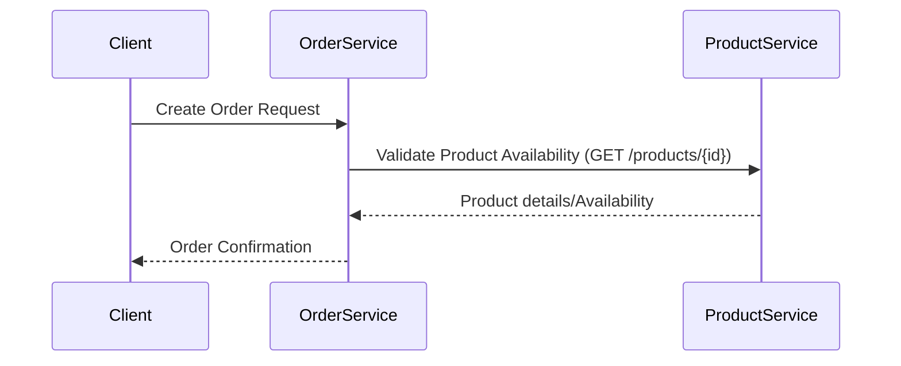

# Sample Spring Boot API Description

## Application 1: Product Service
- Endpoint: GET /products — Retrieve a list of products.
- Endpoint: POST /products — Create a new product.
- Endpoint: GET /products/{id} — Retrieve product details.

## Application 2: Order Service
- Endpoint: GET /orders — Retrieve a list of orders.
- Endpoint: POST /orders — Create a new order.
- Endpoint: GET /orders/{id} — Retrieve order details.
- Acts as a client to Product Service to validate product availability.

## Swagger Documentation Example
A minimal Swagger/OpenAPI snippet for the APIs:
```yaml
openapi: "3.0.1"
info:
  title: Product and Order Services API
  version: "1.0.0"
paths:
  /products:
    get:
      summary: Retrieve list of products
      responses:
        '200':
          description: List of products
    post:
      summary: Create a new product
      responses:
        '201':
          description: Product created
  /products/{id}:
    get:
      summary: Retrieve product details
      parameters:
        - name: id
          in: path
          required: true
          schema:
            type: string
      responses:
        '200':
          description: Product details
  /orders:
    get:
      summary: Retrieve list of orders
      responses:
        '200':
          description: List of orders
    post:
      summary: Create a new order
      responses:
        '201':
          description: Order created
  /orders/{id}:
    get:
      summary: Retrieve order details
      parameters:
        - name: id
          in: path
          required: true
          schema:
            type: string
      responses:
        '200':
          description: Order details
```

## Sequence Diagram for API Integration
The following sequence diagram illustrates the integration between the Order Service and Product Service:


## Integration and Endpoint Details
- The Product Service offers endpoints for managing products:
  - GET /products: Returns a list of products.
  - POST /products: Accepts product details to create a new product.
  - GET /products/{id}: Retrieves detailed information about a specific product.
- The Order Service offers endpoints for managing orders:
  - GET /orders: Returns a list of orders.
  - POST /orders: Accepts order details to create a new order.
  - GET /orders/{id}: Retrieves detailed information about a specific order.
- Cross-application Integration:
  - When an order is created via POST /orders, the Order Service calls GET /products/{id} on the Product Service to verify product availability.
  - This integration helps ensure that only valid and available products are ordered.
- Both services expose interactive Swagger UI documentation (typically at /swagger-ui.html) for testing and further investigation.
